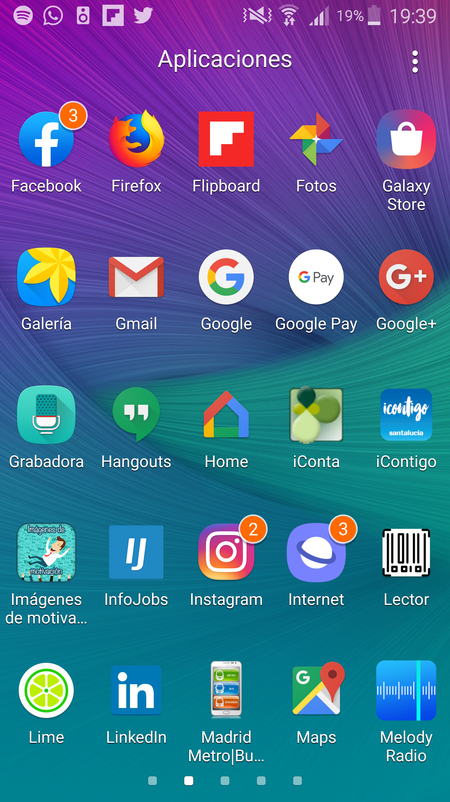

# Lector de Código de Barras

Appp que permite escanear cualquier código de barras para obtener información adicional de cualquier producto.

¡Es 100 % GRATIS!

Descargo de responsabilidad:
* Esta aplicación se basa en el proyecto de código de barras escáner ZXing abierto. Apache License 2.0.

## Ejecutar la aplicación

Seleccionar la aplicación **Lector**  

  
Se abre la interfaz de la aplicación donde podemos pulsar el *botón ESCANERA*
  

Se abrira el lector de código de barras para escanear cualquier código
  

  
Una vez que lea el código de barras se presentara en pantalla el valor del código
  

  
Si pulsamos el *botón SALIR* la aplicación se cerrara
